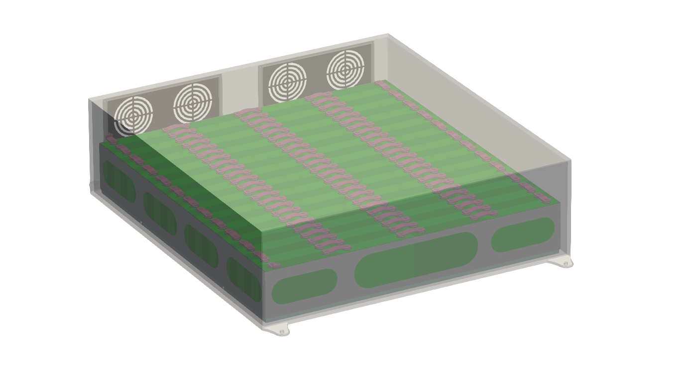

# Heat transfer in an electric car’s battery pack modeled in Q-Bat

### :arrow_down: Please use this link instead of the download button: [Download link](https://github.com/QuickerSim/Electric-car-Q-Bat-use-case/releases/download/1.0.0/Electric-car-Q-Bat-use-case.zip) :arrow_down:

Run battery_pack_96S1P.m and electric_car_livescript.mlx to get started 
* Please visit the [Q-Bat](https://www.mathworks.com/products/connections/product_detail/quickersim-q-bat.html) and [QuickerSim](https://emobility.quickersim.com/) 
page to learn more about modeling heat transfer in 3-D systems.

This repository shows how to model heat transfer in an electric car’s battery pack in Q-Bat from QuickerSim. The model consists 96 lithium prismatic cells (96s1p), terminals, connectors, holders, casing and cooling plates and is connected to a reduced-order model (ROM) to model heat transfer in 3D geometry. 

## **Simulation Model**

## **Simulation Results**

